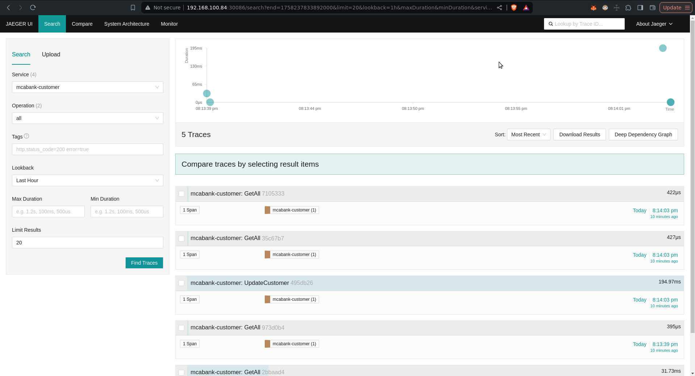

# MCABank

O **MCABank** é um sistema bancário digital construído sobre arquitetura de microserviços, com foco em segurança, escalabilidade e modularidade.  

Este repositório serve como ponto central de documentação e orquestração de todos os serviços que compõem o ecossistema MCABank.  
Ele não contém código-fonte de serviços específicos, mas agrupa informações, links e guias para facilitar o desenvolvimento e a operação.

---

## Índice

1. [Arquitetura](#arquitetura)  
   1.1 [Principais características](#principais-características)  
   1.2 [Diagramas](#diagramas)  

2. [Serviços Principais](#serviços-principais)  

3. [Tecnologias](#tecnologias)  
   3.1 [Linguagens e Frameworks](#linguagens-e-frameworks)  
   3.2 [Banco de Dados](#banco-de-dados)  
   3.3 [Mensageria e Filas](#mensageria-e-filas)  
   3.4 [Infraestrutura](#infraestrutura)  
   3.5 [Autenticação e Segurança](#autenticação-e-segurança)  
   3.6 [CI/CD e DevOps](#cicd-e-devops)  
   3.7 [Observabilidade](#observabilidade)  
   3.8 [Boas práticas e padrões](#boas-práticas-e-padrões)  
   3.9 [Benefícios das boas práticas](#benefícios-das-boas-práticas)  

4. [Como Rodar no Cluster MicroK8s Local](#como-rodar-no-cluster-microk8s-local)  
   4.1 [Infraestrutura do Cluster](#infraestrutura-do-cluster)  
   4.2 [Fluxo de Deploy](#fluxo-de-deploy)  

5. [Como Rodar Localmente](#como-rodar-localmente)  
   5.1 [Pré-requisitos](#pré-requisitos)  
   5.2 [Passos](#passos)
    
6. [Gerador de Swagger Automático](#gerador-de-swagger-automático)  

7. [Testes Unitários](#testes-unitários)

8. [Geração de Protobuff com Buf](#geração-de-protobuff-com-buf)

---

## Arquitetura

O MCABank é dividido em múltiplos serviços independentes que se comunicam entre si via APIs REST/gRPC e eventos assíncronos.  

### Principais características:
- Autenticação e autorização centralizadas  
- Gerenciamento de clientes  
- Processamento de pagamentos  
- API Gateway para unificação do acesso  
- Definições de contratos em Protobuff para comunicação eficiente  
- Frontend web integrado aos serviços  

### Diagramas

**Arquitetura Atual**:  


**Fluxo de CI/CD Atual**:  

---

**Arquitetura Futura**:  


**Fluxo de CI/CD Futuro**:  

---

## Serviços Principais

- **[MCABankAuth](https://github.com/rasteiro11/MCABankAuth)** → Gerenciamento de usuários, autenticação e autorização.  
- **[MCABankCustomer](https://github.com/rasteiro11/MCABankCustomer)** → Cadastro e gerenciamento de clientes.  
- **[MCABankPayment](https://github.com/rasteiro11/MCABankPayment)** → Processamento de pagamentos.  
- **[MCABankGateway](https://github.com/rasteiro11/MCABankGateway)** → API Gateway para roteamento, autenticação e entrada unificada.  
- **[MCABankProtobuff](https://github.com/rasteiro11/MCABankProtobuff)** → Definições de contratos gRPC para padronização de comunicação entre serviços.  
- **[MCABankFrontEnd](https://github.com/rasteiro11/MCABankFrontEnd)** → Interface web para interação com os serviços do sistema.  
- **[PogCore](https://github.com/rasteiro11/PogCore)** → Core de desenvolvimento de microsserviços em Go.


---

## Tecnologias

### Linguagens e Frameworks
- **Go** – Backend, microsserviços.
- **TypeScript / Angular** – Frontend web.
- **gRPC / Protobuf** – Comunicação padronizada entre microsserviços.
- **PogCore** – Core para desenvolvimento de microsserviços em Go com padrões e utils.

### Banco de Dados
- **MySQL** – Persistência.

### Mensageria e Filas
- **Amazon SQS (LocalStack)** – Filas assíncronas para eventos.

### Infraestrutura
- **Docker** – Containerização de serviços.
- **Kubernetes (MicroK8s)** – Orquestração de containers.
- **ArgoCD** – GitOps para deploy contínuo.
- **ConfigMaps / Secrets** – Gestão de configuração e credenciais por serviço.
- **DockerHub** – Registry das imagens Docker geradas.
- **Jeager** – Coleta, armazena e visualiza traces.
- 
**Argo Local**:  


**Jeager Local**:  


### Autenticação e Segurança
- **JWT** – Tokens de autenticação.

### CI/CD e DevOps
- **GitHub Actions** – Build, testes e publicação de imagens.
- **GitOps** – Deploy e sincronização do estado do cluster via ArgoCD.

### Observabilidade
- **Jaeger** – Planejado para tracing distribuído entre microsserviços.  
- **OpenTelemetry** – Coleta unificada de métricas, traces e logs distribuídos.

---

### Boas práticas e padrões

- **Microsserviços isolados por responsabilidade** – cada serviço é independente e encapsula sua lógica e dados.  
- **Isolamento dos serviços no cluster** – cada microsserviço roda em seu próprio namespace/deployment, evitando interferência e facilitando escalabilidade.  
- **Versionamento de contratos (Protobuf) e imagens Docker** – garante rastreabilidade e compatibilidade entre serviços.  
- **Estrutura de repositórios modular** – cada serviço mantém sua própria configuração de infraestrutura (manifests, ConfigMaps, Secrets).  
- **CI/CD automatizado e GitOps** – pipelines para build, testes e deploy via ArgoCD.  
- **Mensageria assíncrona** – uso de filas (SQS) para robustez.  
- **Rastreabilidade e observabilidade** – integração com OpenTelemetry e Jaeger.  
- **Testes automatizados** – unitários.  
- **Documentação de APIs com Swagger** – padronização e fácil integração entre serviços e com clientes.  
- **Utilização de um core para desenvolvimento de microsserviços** – todos os serviços Go utilizam o **PogCore** para padronização de middlewares, logging, tracing, validação e integração com filas/DB, garantindo consistência entre microsserviços.  
- **Boas práticas de segurança** – autenticação via JWT, segredos gerenciados via Kubernetes Secrets.  

---

### Benefícios das boas práticas

- **Escalabilidade** – microsserviços isolados e deploys independentes permitem escalar apenas o que é necessário.  
- **Manutenção simplificada** – repositórios modulares e PogCore padronizam desenvolvimento e reduzem duplicação de código.  
- **Segurança aprimorada** – autenticação via JWT e gerenciamento de segredos via Kubernetes Secrets garantem proteção de dados sensíveis.  
- **Rastreabilidade e monitoramento** – integração com OpenTelemetry e Jaeger permite identificar problemas rapidamente.  
- **Padronização de APIs** – contratos Protobuf e documentação Swagger facilitam integração entre serviços e com clientes.  
- **Confiabilidade** – pipelines CI/CD, testes unitários e GitOps reduzem risco de falhas em produção e possibilitam rollbacks rápidos.  
- **Desacoplamento e resiliência** – mensageria assíncrona (SQS) tornando o sistema mais robusto frente a indisponibilidades momentâneas.


---
## Como Rodar no cluster microk8s local

Atualmente, o MCABank possui um **cluster local** baseado em MicroK8s, com Argo CD para GitOps e pipelines de CI/CD via GitHub Actions. O fluxo de desenvolvimento e deploy funciona da seguinte forma:

---

### Infraestrutura do Cluster

- **Cluster local:** MicroK8s  
- **Gerenciamento de deploys:** Argo CD  
- **CI/CD:** GitHub Actions detecta alterações nos repositórios, builda imagens Docker e atualiza automaticamente os manifests no Argo CD  
- **Serviços no cluster:**  
  - MCABankAuth  
  - MCABankCustomer  
  - MCABankPayment  
  - MCABankGateway  
  - MCABankFrontEnd  
- **Infraestrutura compartilhada:**  
  - MySQL  
  - LocalStack (SQS)  
- **Observabilidade e logs:** via kubectl logs e Jaeger com OpenTelemetry

---

### Como funciona o fluxo de deploy
**Fluxo de CI/CD**:  

1. Ao fazer um **commit/push** no repositório Git.  
2. O **GitHub Actions pipeline**:
   - Builda a imagem Docker do serviço modificado
   - Roda os testes e validação de codigo estática
   - Publica imagem do container no DockerHub
3. O **Argo CD** detecta automaticamente a mudança no repositório Git.  
4. Argo CD aplica os manifests atualizados no cluster, sincronizando os serviços.  
5. Os pods são atualizados sem necessidade de intervenção manual, garantindo **GitOps completo**.  

---

## Como Rodar Localmente

Para desenvolvimento local simples (sem usar Kubernetes), você pode rodar apenas os serviços de infraestrutura com **Docker Compose** e executar os microsserviços manualmente.

### Pré-requisitos
- [Go](https://go.dev/doc/install) ≥ 1.22  
- [Node.js](https://nodejs.org/en/download) ≥ 20  
- [Angular CLI](https://angular.dev/tools/cli) ≥ 17  
- [Docker](https://docs.docker.com/get-docker/)  
- [Docker Compose](https://docs.docker.com/compose/install/)  
- [Git](https://git-scm.com/downloads)  

### Passos

1. **Clone os repositórios necessários**
   ```bash
   git clone https://github.com/rasteiro11/MCABank
   cd MCABank/
   git clone https://github.com/rasteiro11/MCABankAuth
   git clone https://github.com/rasteiro11/MCABankCustomer
   git clone https://github.com/rasteiro11/MCABankPayment
   git clone https://github.com/rasteiro11/MCABankGateway
   git clone https://github.com/rasteiro11/MCABankProtobuff
   git clone https://github.com/rasteiro11/MCABankFrontEnd
   git clone https://github.com/rasteiro11/PogCore
   ```

2. **Subir os serviços de infraestrutura**
Entre no diretório e rode o script:  
```bash
    cd LocalInfra/
    bash run_services.sh
```
---

## Gerador de Swagger Automático

1. Entre no diretório da aplicação:
   ```bash
   cd <diretório-da-aplicação>
   ```
2. Execute:
   ```bash
   swag init -g ./cmd/main.go -o docs
   ```
3. Após iniciar a aplicação, acesse a documentação Swagger pelo navegador em:
   ```
   http://<host>:<porta>/swagger/index.html
   ```
---

## Testes Unitários

1. Gere os mocks e códigos necessários:
   ```bash
   go generate ./...
   ```
2. Execute os testes:
   ```bash
   go test ./...
   ```
---

## Geração de Protobuff com Buf

1. Execute o comando:
   ```bash
   buf generate https://github.com/rasteiro11/MCABankProtobuff.git
   ```
2. Utilize os arquivos gerados em seus serviços para garantir consistência de contratos gRPC entre microsserviços.

